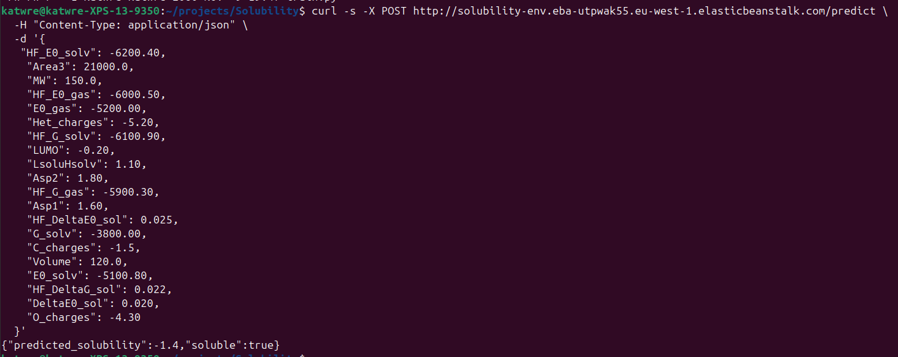
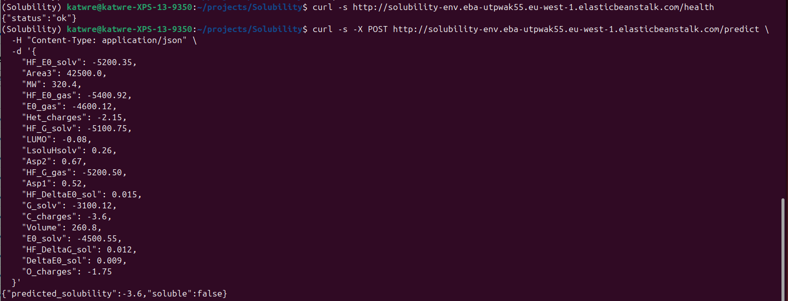

# Introduction

### Concept: what drives solubility?

<figure>
<p align="center">
  
</p>
  <figcaption align="center"><b>Figure.</b> Concepts of solubility prediction and data availability. Physical aspects of dissolution process of solid and corresponding descriptors by [Boobier et al Nature Communications 2020](https://www.nature.com/articles/s41467-020-19594-z) </figcaption>
</figure>


In the literature the dissolution problem, i.e. whether a solid dissolves in a liquid, is split into three interaction types:

- Solvent - solvent = how the solvent molecules interact with each other (top of triangle). For a given solvent (water, ethanol, benzene, acetone) this is constant, so there's nothing to learn per compound - no feature needed. Some liquids are naturally better at dissolving things (water is great, oil is not), but since the liquid in each dataset is the same, we don't need to model this.
- Solute - solute = how strongly the solid holds onto itself (left): how molecules of the solid stick to each other (crystal/lattice strength). They approximate this with the melting point (m.p.)—higher m.p. ≈ stronger solid–solid interactions ≈ harder to dissolve. If the solid is very "stubborn" and its molecules cling tightly together, it won't dissolve easily, but that's not of my interest at the moment.
- Solute - solvent = how well the solid and liquid can interact (right). This is where most of the variation happens. We describe these interactions using a few numeric features, such as:
    - ΔG_solv / ΔE_solv (solvation energies): how the molecule interacts with the solvent
    - SASA (solvent-accessible surface area): how much of the molecule is exposed to the solvent
    - Molar volume, molecular weight (MW): size/weight of the molecule
    - Charge/dipole features (partial charges, dipole): whether it has charge or polarity
    - HOMO–LUMO gap terms (simple frontier-orbital interaction proxies): simple electronic properties

### Aim: predict solubility of a molecule

In other words, we give the model some numbers describing a molecule and ask it: "Will this thing dissolve in a solvent, or will it be stubborn?". First I predict solubility in water - because water is polite and behaves, i.e. the dataset is clean and perfect for a classification task. The other solvents (ethanol, benzene, acetone) are for the sequel, where we find out whether the model can generalize across different solvent environments.

# Project Overview

In this project, I make a use of a publicly available [dataset](https://doi.org/10.5281/zenodo.3686212) published by [Boobier et al Nature Communications 2020](https://www.nature.com/articles/s41467-020-19594-z) of organic molecules in different solvents (water, ethanol, benzene, acetone), along with the physicochemical descriptors described in the introduction. 

I trained a few models, such as Partial least squares (linear baseline), Random forest, and XGBoost (tree model) to predict whether a molecule will dissolve in water.

# 🛠️ Tech Stack

**ML / Data Science**

🧠  numpy • pandas • scikit-learn • xgboost  
📊  seaborn • matplotlib  

**Backend**

🌐  Flask  
🚀  gunicorn  

**MLOps / Deployment**

🐳  Docker  
☁️  AWS Elastic Beanstalk


# 🚀 Results (for users)

If the installation steps make your eyes glaze over, but you actually know how solubility works, test a few molecules via API.

Example prediction request:
```{bash}
curl -s -X POST http://solubility-env.eba-utpwak55.eu-west-1.elasticbeanstalk.com/predict \
  -H "Content-Type: application/json" \
  -d '{
   "HF_E0_solv": -6200.40,
    "Area3": 21000.0,
    "MW": 150.0,
    "HF_E0_gas": -6000.50,
    "E0_gas": -5200.00,
    "Het_charges": -5.20,
    "HF_G_solv": -6100.90,
    "LUMO": -0.20,
    "LsoluHsolv": 1.10,
    "Asp2": 1.80,
    "HF_G_gas": -5900.30,
    "Asp1": 1.60,
    "HF_DeltaE0_sol": 0.025,
    "G_solv": -3800.00,
    "C_charges": -1.5,
    "Volume": 120.0,
    "E0_solv": -5100.80,
    "HF_DeltaG_sol": 0.022,
    "DeltaE0_sol": 0.020,
    "O_charges": -4.30
  }'
```
And the result:
<figure>
<p align="center">
  
</p>
  <figcaption align="center"><b>Figure.</b> Result of an example query.</figcaption>
</figure>

### How to use it?

# 🚀 Quick Start (for developers)

### Organization of the files 

The repository contains:
```{bash}
Solubility/
├── notebooks/
    └── solubility_water.ipynb # Data preparation, cleaning, EDA, feature importance, model selection process, parameter tuning
├── src/
    ├── train.py # script that trains the model and saves it to a model with pickle
    └── predict.py # script that loads the model and serves it via a web service with flask
├── images/ # images used for the readme
├── data/ # input datasets
    └── water_set_narrow_descriptors.csv # our input file
├── output/ # output models
├── Dockerfile # instructions to build the docker image
├── Pipfile # library dependencies
├── Pipfile.lock # library dependencies
└── README.md
```

### Installation

#### Set-up

For **local** development and dependency management use pipenv and follow instructions below.

1. Install Pipenv (if not installed)
```{bash}
pip install pipenv
```
2. Create virtual environment & install dependencies. Run this command from the project directory, where the Pipfile and Pipfile.lock are located.
```{bash}
pipenv install
```
3. Activate the environment
```{bash}
pipenv shell
```

4. Run the service using gunicorn:

Install gunicorn (if not installed)
```{bash}
pip install gunicorn
```

5. Run the service:
```{bash}
gunicorn --bind 0.0.0.0:9696 predict:app
```

6. And run the example!
```{bash}
curl -s -X POST http://127.0.0.1:9696/predict \
  -H "Content-Type: application/json" \
  -d '{
    "HF_E0_solv": -6200.40,
    "Area3": 21000.0,
    "MW": 150.0,
    "HF_E0_gas": -6000.50,
    "E0_gas": -5200.00,
    "Het_charges": -5.20,
    "HF_G_solv": -6100.90,
    "LUMO": -0.20,
    "LsoluHsolv": 1.10,
    "Asp2": 1.80,
    "HF_G_gas": -5900.30,
    "Asp1": 1.60,
    "HF_DeltaE0_sol": 0.025,
    "G_solv": -3800.00,
    "C_charges": -1.5,
    "Volume": 120.0,
    "E0_solv": -5100.80,
    "HF_DeltaG_sol": 0.022,
    "DeltaE0_sol": 0.020,
    "O_charges": -4.30
  }'
```
You should get a result such as:
```{bash}
{"predicted_solubility":-1.4,"soluble":true}
```

7. To exit the virtual environment:
```{bash}
exit # or deactivate
```

For the production environment, Docker is used to containerize the application and make **deployment** to e.g. AWS Elastic Beanstalk simple and reproducible. Follow the instructions below to build and run the Docker image.

🐳 Build and run the Docker image (locally).

1. Build the image
```{bash}
docker build -t solubility-api .
```
2. Run the container:
```{bash}
docker run -p 9696:9696 solubility-api
```

🌐 Deploy to AWS Elastic Beanstalk

Requirements: AWS CLI + EB CLI (awsebcli). Install EB CLI (inside Pipenv environment):
```{bash}
pipenv install awsebcli --dev
```

1. Initialize the Elastic Beanstalk application (run once)
```{bash}
eb init -p docker -r eu-west-1 solubility-serving
```

2. Create an environment (run once)
```{bash}
AWS_PROFILE=learn-aws eb create solubility-env --single
```

After deployment, Elastic Beanstalk assigns a public URL, e.g. solubility-env.eba-utpwak55.eu-west-1.elasticbeanstalk.com.


### How to test the API?

Health check:
```{bash}
curl -s http://solubility-env.eba-utpwak55.eu-west-1.elasticbeanstalk.com/health
```

Example prediction request:
```{bash}
curl -s -X POST http://solubility-env.eba-utpwak55.eu-west-1.elasticbeanstalk.com/predict \
  -H "Content-Type: application/json" \
  -d '{
    "HF_E0_solv": -5200.35,
    "Area3": 42500.0,
    "MW": 320.4,
    "HF_E0_gas": -5400.92,
    "E0_gas": -4600.12,
    "Het_charges": -2.15,
    "HF_G_solv": -5100.75,
    "LUMO": -0.08,
    "LsoluHsolv": 0.26,
    "Asp2": 0.67,
    "HF_G_gas": -5200.50,
    "Asp1": 0.52,
    "HF_DeltaE0_sol": 0.015,
    "G_solv": -3100.12,
    "C_charges": -3.6,
    "Volume": 260.8,
    "E0_solv": -4500.55,
    "HF_DeltaG_sol": 0.012,
    "DeltaE0_sol": 0.009,
    "O_charges": -1.75
  }'
```

And it works! 🎉
<figure>
<p align="center">
  
</p>
  <figcaption align="center"><b>Figure.</b> Result of an example queries.</figcaption>
</figure>


